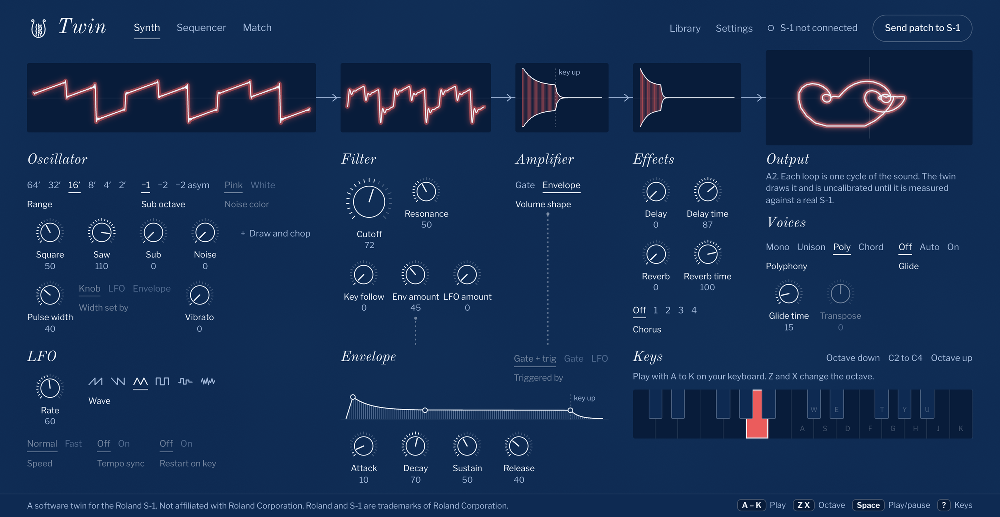
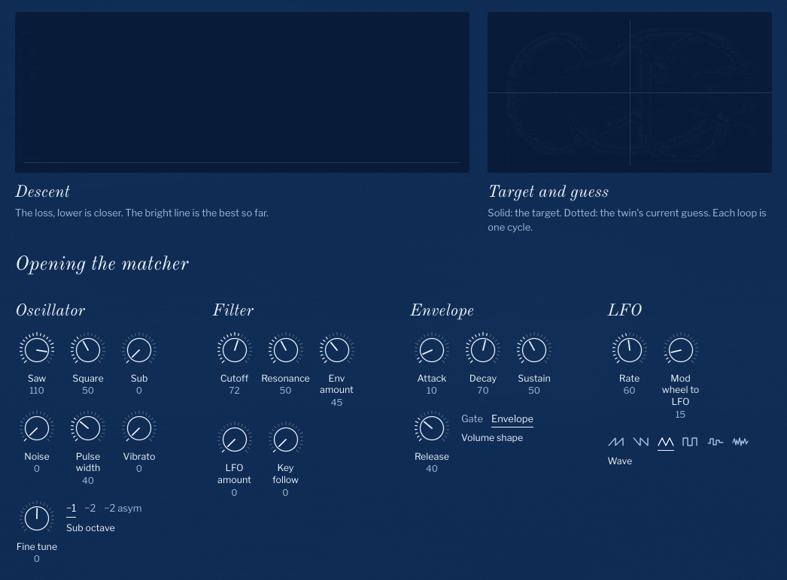
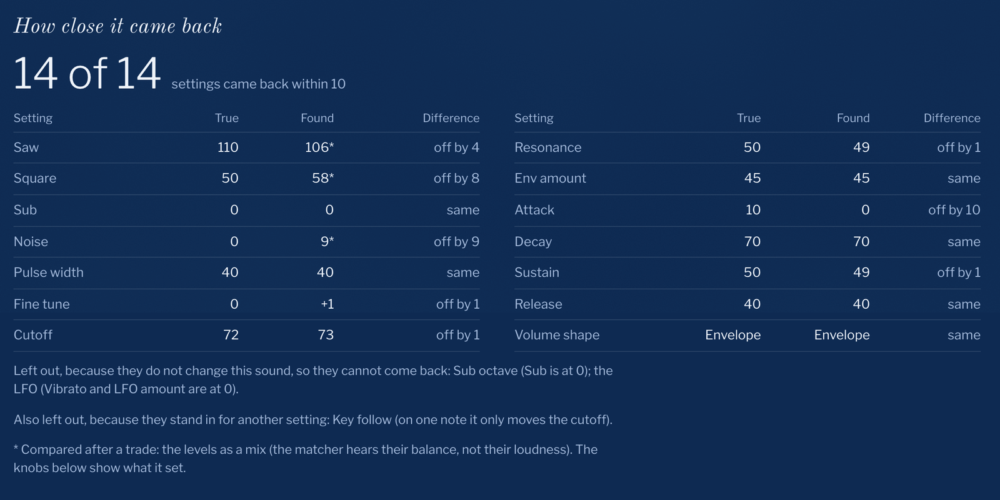
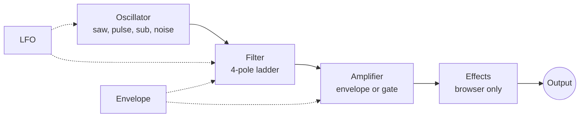

<p align="center">
  
</p>

<h1 align="center">Twin</h1>

<p align="center">
  A software twin of the Roland S-1 synthesizer. Play it in your browser, see inside every stage<br>
  of the sound, and watch it learn a sound by gradient descent.
</p>

<p align="center">
  <a href="https://tylerwhughes.com/s1-twin/"><b>Play it in your browser</b></a><br>
  <sub>or <a href="#install">install it</a> to sync a real S-1 and match your own sounds</sub>
</p>

<br>



The S-1 is Roland's small SH-101-style synthesizer. Twin is a model of it that you can
differentiate. The same equations run in Python, for gradient descent, and in your browser, for
playing, and a test checks on every run that the two agree. Plug a real S-1 into the computer and
the page becomes its front panel.

## Play it

Every stage of the sound has a window: the oscillator, the filter, the amplifier, the effects and
the output. Turn a knob and the windows redraw, so you see what the knob does to the wave. The
output is drawn as a *plume*: each loop is one cycle of the sound, and sharper turns mean a brighter
tone. A held note colors the chain by its pitch.

The whole synth fits one laptop screen. Play it from your computer keyboard or a MIDI keyboard
(Chrome). A piano-roll sequencer keeps playing while you turn the knobs.

| Key | What it does |
|---|---|
| <kbd>A</kbd> to <kbd>K</kbd> | Play (the row above plays the black keys) |
| <kbd>Z</kbd> <kbd>X</kbd> | Octave down, octave up |
| <kbd>Space</kbd> | Play or pause the sequence, from any view |
| <kbd>Shift</kbd> <kbd>Space</kbd> | Stop |
| <kbd>1</kbd> <kbd>2</kbd> <kbd>3</kbd> | Synth, Sequencer, Match |
| <kbd>?</kbd> | Show every key |

## Teach it

Give the matcher a sound: drop in a file, record one from a microphone or the S-1, or let it test
itself on the synth's current sound. It turns the twin's knobs by gradient descent until the twin
sounds the same, and you watch every step.



The self-test is the honest one. The synth plays a note with settings the matcher never sees, and
the matcher starts from scratch. In the run above the target is in Gate mode, a switch setting the
matcher has to find for itself. It found Gate, and brought 15 of the 17 settings that shape the
sound back to within 10 (on the knobs' 0 to 127 scale), at 73% closeness, in two and a half
minutes on a laptop:



**Record anything.** Record from a microphone, the S-1 or this Mac's own sound (a Logic Pro
instrument, say; macOS 14.2 or later), or drop in a file. The matcher finds the
sound in the take, whatever silence, noise or clicks surround it, marks the note it hears (one sung
note is one note, with its cents), and works out how long the key was held. **Play target** plays
exactly what the matcher gets; **Play my patch** plays the synth's current sound beside it. When a
sound is out of the S-1's reach, the page says so and why: a sung vowel has two or more resonances,
and the S-1's filter makes one.

## Sync a real S-1

Plug the S-1 in over USB and the page becomes its front panel:

- every knob and menu setting, live in both directions;
- the S-1's audio on your speakers, with no DAW;
- the sequencer, with MIDI clock;
- a patch library, and **Save to S-1** for patterns.

While the S-1 is connected, the output window draws its real signal in bronze, with the twin's
prediction dotted over it, so you can see how close the twin is.

## How the twin works



- **Oscillators** are additive Fourier series: band-limited, and differentiable in every knob,
  pulse width included.
- **The filter** is the transfer function of an analog 4-pole ladder,
  H(s) = (1 + k) / ((1 + s)⁴ + k), applied in the frequency domain. A moving cutoff is an
  overlap-add of short frames, each with its own ladder, which keeps the gradient cheap.
- **From knob to sound.** Each knob's 0 to 127 maps to a physical unit (hertz, seconds, a ratio)
  through a curve. The curves are what a calibration run fits to a real S-1.
- **The matcher** runs Adam on 18 continuous knobs, from plain starting patches (one or two
  oscillators, the extras off). Each descent keeps going until it stops improving, with a step size
  that shrinks on a cosine schedule, and a light penalty keeps noise, sub and vibrato out unless
  they clearly help. After each start it scores every setting of the 3 switches (sub octave, LFO
  wave, volume shape) and re-tunes the knobs under the most promising ones; it also scans the LFO's
  wave and rate, and how long the note was held. A slow final polish starts from the best patch. The loss is a log-mel distance, plus a multi-resolution spectrogram term and an
  envelope term, on loudness-normalized audio. It ignores whatever lies more than 50 dB below the
  note: room noise and echo tails there used to count as much as the note itself. **Quick** is one start (about 30 seconds),
  **Thorough** four starts (2 to 3 minutes), and **Deep** eight starts with every switch setting
  (up to 10 minutes). **Finish now** stops early and keeps the best patch so far.
- **The browser twin** is the same model in an AudioWorklet. Every test run checks it against the
  Python: 0.001 log-mel apart offline and 0.07 in real time, where two different patches are at
  least 1.9 apart.

## Status, honestly

- **The twin is not yet calibrated against real hardware.** Its knob-to-sound curves are informed
  guesses. A calibration run fits them from a few hundred recorded notes of a real S-1, and an ear
  test checks that the matcher's idea of "closer" agrees with a listener. Until that session runs,
  a match is only as true as the twin.
- On the twin's own sounds the matcher brings the settings back (the self-test above). The
  reproduction suite (`tools/match_suite.py`, 12 twin-made sounds) reaches 71 to 96% closeness on
  ten of them with Thorough, with every setting back within 10 on nine; a low bass and a high narrow
  pulse are weaker (35 and 55%). Their "recorded" copies, through a small speaker and a room with
  noise around them, get two thirds of their settings back; their closeness reads 12 to 19%, because
  that number still counts the room's echo and noise. Closeness is not yet checked by ear
  (`docs/match-benchmarks.md`, `docs/match-baseline.json`).
- **Voices are out of the S-1's reach.** A vowel is two or more resonances; the S-1 has one filter,
  so the matcher gets the pitch, the loudness shape and one resonance, not the vowel. On six sung
  and whistled takes the matcher now hears the right single note every time, and reaches 6 to 24%
  closeness. Draw and Chop, which the twin does not model yet, may reach further.
- Delay, reverb, chorus and the voice modes are browser extras outside the model: they sound, but
  the matcher does not fit them. Draw and Chop need the real S-1.
- Tested in Chrome. Safari is untested.

## Install

Python 3.10 or newer (3.12 recommended):

```bash
python3.12 -m venv .venv
.venv/bin/pip install "synth[studio,twin] @ git+https://github.com/twhughes/s1-twin"
.venv/bin/s1            # opens the page; plug in an S-1 any time
```

```bash
s1                  # the page (opens the browser); same as `synth`
s1 --no-browser     # just the server, on 127.0.0.1:8766
s1 --list-ports     # the MIDI ports the computer sees
synth-match         # the matcher's command line
synth-prm           # read and write .PRM pattern files
```

<details>
<summary><b>How sync works, and why</b></summary>

The S-1 has **no SysEx**: its state cannot be read back. The only live signals are CCs: knobs
transmit when moved, and the synth accepts CCs in. So the app treats **its own state as the
truth**: on every (re)connect it pushes all 54 CC parameters to the device, then knob twists
stream in and win over the page. Unplug and replug freely; it reconnects and re-pushes by itself.

The S-1 **is** class-compliant USB audio over the same cable (a 2-in "S-1" device in CoreAudio).
The app routes it to the default output, which is how you hear it with no DAW.

</details>

<details>
<summary><b>Save to S-1: patterns into the hardware</b></summary>

Patterns transfer through USB disk mode, not MIDI. The Library builds a device-ready
`S1_PTN<bank>-<slot>.PRM` from the live patch and sequence (the format is community-decoded plain
text; the writer templates off a real device dump so it never invents keys):

1. Power the S-1 off. Hold **Play** while you power it on.
2. Wait one to two minutes for a drive named `S-1` (the app notices, and can write the file into
   `RESTORE/` for you; otherwise download it and copy it yourself).
3. Press **Hold** on the S-1, wait for `dOnE`, then power-cycle it.

It also reads the other way: **Load from the S-1** lists the mounted device's saved patterns and
loads one, patch and sequence, live and editable.

</details>

<details>
<summary><b>The agent door: everything is an endpoint</b></summary>

Everything the page does is a documented endpoint (interactive docs at
`http://127.0.0.1:8766/docs`): read or set any parameter, patches, sequences, transport, notes,
device patterns, `.prm` export, a test note from the S-1, and the twin matcher over `/ws/match`.
Live state, including physical knob twists, streams over `/ws/state`.

```bash
curl -X PUT localhost:8766/api/params/74 -H 'content-type: application/json' -d '{"value": 90}'
curl -X POST localhost:8766/api/notes -H 'content-type: application/json' -d '{"note": 60, "on": true}'
```

</details>

## Development

```bash
/usr/local/bin/python3.12 -m venv .venv          # Homebrew python3 may be newer than the deps support
.venv/bin/pip install -e ".[studio,twin,dev]"
.venv/bin/python -m pytest                      # the whole suite runs on fake MIDI and audio: no hardware
.venv/bin/ruff check .
node synth/web/static/design/kit.check.mjs      # front-end checks live next to their modules (*.check.mjs)
.venv/bin/python tools/build_site.py            # the static page (browser twin only) into site/
.venv/bin/python tools/match_suite.py           # the reproduction suite, against docs/match-baseline.json
```

Layout: `synth/schema.py` and `synth/data/s1.json` (every parameter, audited against the official
MIDI chart), `synth/engine.py` (port watcher, sync, keyboards), `synth/audio.py` (S-1 USB audio to
speakers), `synth/match/twin.py` (the differentiable model), `synth/match/twin_session.py` (the
streaming matcher), `synth/web/` (FastAPI) and `synth/web/static/` (the one front-end: the design
kit in `design/`, the browser twin in `twin/`, the transport and keys in `core/`, views in `views/`).
The design direction lives in `docs/design/`.

## Credits

MIT licensed. Twin is a working title. Not affiliated with Roland Corporation; Roland and S-1 are
trademarks of Roland Corporation, used here only to say what this works with. Fonts: Old Standard TT
and Libre Franklin, under the SIL Open Font License (texts in `synth/web/static/design/fonts/`).
